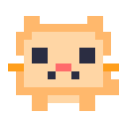
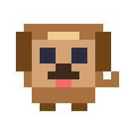
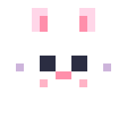
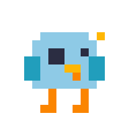

<div align="center">


# 🤡 机器人感知结构炼丹师 / Bug Manufacturing Engineer


<br>

[](https://git.io/typing-svg)


</div>

---

## 🧪 当前人格 / Current Personality

我是一名机械背景的研究生，目前正在转行向机器人方向。

I am a graduate student with a mechanical engineering background, and I am currently switching my focus to robotics.

目前主要关注 **机器人感知 / Robot Perception**、**机器人结构 / Robot Structure**、**机器视觉 / Machine Vision**、**具身智能 / Embodied AI**

```text
Robot Perception / 机器人感知
OpenCV C++ -> Camera Calibration & Homography
-> Grasp Pose Estimation
-> ROS2 Perception Nodes
-> 3D Vision / PCL
-> PyTorch / YOLO Deep Vision
```

```text
Robot Structure / 机器人结构
Mechanical Design
-> End Effector & Gripper
-> Robot Joint Module
-> Lightweight Robotic Arm
-> FEA & Structural Optimization
```

---

## 🤹‍♂️ 核心技术栈 / Core Stack

<div align="center">
  
  
  
  
  
  
</div>

<br>

<div align="center">
  
  
  
  
</div>

<br>

<div align="center">
  
  
  
  
</div>

---


## 🌱 Long-Term Goal / 长期目标

```text
实现财富自由，开上帕拉梅拉，住上大平层。
Achieve financial freedom, drive a Panamera, and live in a large apartment.
```


---

<div align="center">




<br>

<b>Pixel GitHub Dashboard：小猫负责看访客，小狗负责数提交。</b>

<br><br>


</div>

<br>

<div align="center">


</div>

<br>

```text
 /\_/\\   Mochi.cat: "访客 +1，已记录到小鱼干账本。"
( o.o )
 > ^ <    Debug.dog: "提交记录巡逻完成，GitHub 今日无异常。"
```

> 这里展示的是 GitHub 相关动态数据：访客、followers、stars、提交与语言统计。若某张统计卡偶尔加载失败，通常是第三方统计服务缓存或限流问题。
<div align="center">





<br>

<b>Pixel pets are closing the lab. See you in the next commit.</b>

</div>

---

## 🟩 Annual Contributions / 年度提交日历

<div align="center">


</div>


